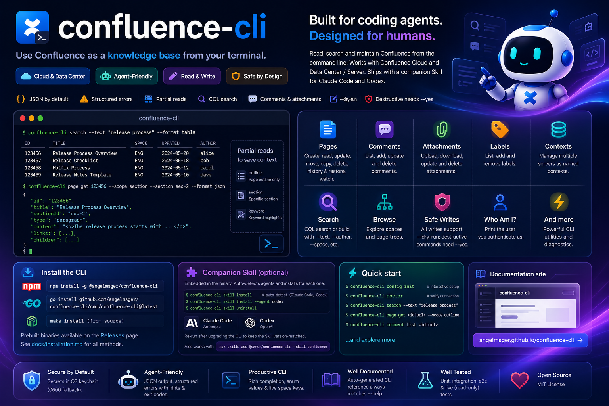

# confluence-cli

[](https://github.com/angelmsger/confluence-cli/actions/workflows/ci.yml)
[](https://www.npmjs.com/package/@angelmsger/confluence-cli)
[](go.mod)
[](LICENSE)
[](https://angelmsger.github.io/confluence-cli/)
[](https://www.atlassian.com/software/confluence)

> Use Confluence as a knowledge base from your terminal — built for coding agents.

`confluence-cli` lets coding agents (Claude Code and others) — and humans — read,
search and **maintain** a Confluence instance from the command line: fetch and
edit pages, manage attachments, labels and comments. It speaks to both
**Confluence Cloud** and **Data Center / Server**, returns agent-friendly JSON
with structured errors, and ships a companion Skill that teaches an agent how to
use it. Write commands support `--dry-run`, and destructive ones require `--yes`.

📖 **Documentation site:** <https://angelmsger.github.io/confluence-cli/>



## Features

- **Cloud & Data Center** — one flavor-agnostic client; the backend is detected
  automatically.
- **Agent-friendly** — JSON output by default, structured errors with exit
  codes and recovery hints, and partial page reads (`outline` / `section` /
  `keyword`) so an agent spends minimal context.
- **Read & write** — fetch pages and browse trees, CQL search; create, edit,
  move, delete and restore pages; manage attachments, labels, comments and page
  watches. Every write supports `--dry-run`; destructive commands need `--yes`.
- **Flexible configuration** — CLI flags, environment variables, a `.env` file,
  a YAML config file, or an interactive wizard; secrets stored in the OS
  keychain.
- **Companion Skill** — a `confluence` Skill, embedded in the binary, that
  guides coding agents through the CLI.

## Installation

### Install the CLI

```bash
npm install -g @angelmsger/confluence-cli                                   # npm
go install github.com/angelmsger/confluence-cli/cmd/confluence-cli@latest   # go
make install                                                                # from source
```

Or download a prebuilt binary from the
[Releases page](https://github.com/angelmsger/confluence-cli/releases). The full
[installation guide](docs/installation.md) covers every method.

### Shell completion (optional)

`confluence-cli` completes subcommands, enum flag values and live space keys.
Load the completion script for your shell once:

```bash
source <(confluence-cli completion bash)                       # bash, current shell
confluence-cli completion zsh > "${fpath[1]}/_confluence-cli"   # zsh, persistent
```

fish, PowerShell and persistent setup are covered in
[docs/installation.md](docs/installation.md#2-enable-shell-completion).

### Companion Skill (optional)

The `confluence` Skill is embedded in the binary; deploy it for your coding
agent. `skill install` probes for installed agents (**Claude Code**, **Codex**)
and installs into each one found:

```bash
confluence-cli skill install            # auto-detect; install for each agent found
confluence-cli skill install --agent codex
confluence-cli skill uninstall          # remove it again
```

Re-run it after upgrading the CLI to keep the Skill version-matched. Details,
including the `npx skills` workflow, are in
[docs/installation.md](docs/installation.md#3-install-the-companion-skill).

## Quick start

```bash
confluence-cli config init --pretty   # interactive TUI setup (recommended for humans)
confluence-cli doctor                 # verify configuration and connectivity

confluence-cli search --text "release process"
confluence-cli page get <id|url> --scope outline
confluence-cli page get <id|url> --scope section --section sec-2
confluence-cli comment list <id|url>
```

## Configuration

Settings resolve in precedence order (highest first): CLI flags → environment
variables (`CONFLUENCE_*`) → `.env` → `~/.confluence/config.yaml` → defaults.
See `.env.example` and
[docs/installation.md](docs/installation.md). Secrets are stored in the OS
keychain (with a `0600` file fallback) and never written to the config file.

## Commands

| Command | Purpose |
|---------|---------|
| `page get` | fetch a page; render body with `--scope`/`--detail`/`--as` |
| `page children` / `page descendants` | browse the page tree |
| `page create` / `update` / `delete` / `move` / `copy` | write pages; `--dry-run` previews, `delete` needs `--yes` |
| `page history` / `page restore` | list versions; roll a page back to an earlier one |
| `page watch` / `unwatch` / `watch-status` | subscribe to or check page notifications |
| `search` | CQL search, raw or built from `--text`/`--author`/`--space`/... |
| `space list` / `space get` | inspect spaces |
| `comment list` / `add` / `update` / `delete` | read, post, edit and remove comments |
| `attachment list` / `download` / `upload` / `update` / `delete` | inspect, fetch and manage attachments |
| `label list` / `add` / `remove` | manage page labels |
| `whoami` | print the user the credentials authenticate as |
| `skill install` / `skill uninstall` | deploy or remove the embedded companion Skill (Claude Code, Codex) |
| `config get-contexts` / `use-context` / `delete-context` | manage multiple named servers |
| `config` / `auth` / `doctor` / `version` | setup and diagnostics |

In the default JSON output, list commands return a `{items, next, has_more}`
envelope; pass `--cursor` with a prior page's `next` to read the following page,
or `--all` to fetch every page. `--format ndjson` instead streams the items
themselves, one JSON object per line.

### Multiple servers (contexts)

A single config file can hold several Confluence servers as named *contexts*.
Most users need only one and never see the concept — `config init` configures a
`default` context and the flow is unchanged. To work with more than one server,
re-run `config init --pretty` and pick **Add a new context**, then:

```bash
confluence-cli config get-contexts          # list contexts, current marked
confluence-cli config use-context prod      # switch the current context
confluence-cli --use-context prod page get 123   # override for one command
```

`CONFLUENCE_CONTEXT` overrides the current context via the environment. Legacy
single-server config files are read unchanged.

## Development

```bash
make test       # unit + integration tests
make e2e        # build + run against an in-repo mock Confluence server
make e2e-live   # additionally run read-only checks against the real server
make lint       # gofmt + go vet
make docs       # regenerate the CLI reference under docs/cli/
```

The [`docs/cli/`](docs/cli/README.md) reference is generated from the cobra
command tree by `cmd/gen-docs`, so it always matches `--help`. After changing a
command or flag, run `make docs` and commit the result — CI fails if it drifts.

See [docs/technical-design.md](docs/technical-design.md) for the architecture
and `internal/` package layout, [docs/releasing.md](docs/releasing.md) for the
release process, and [CHANGELOG.md](CHANGELOG.md) for the version history.

## License

Released under the [MIT License](LICENSE).
